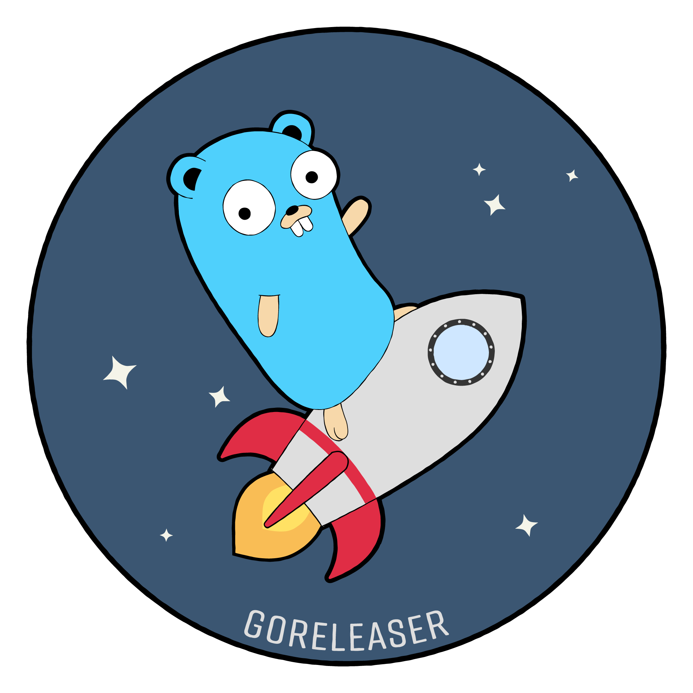
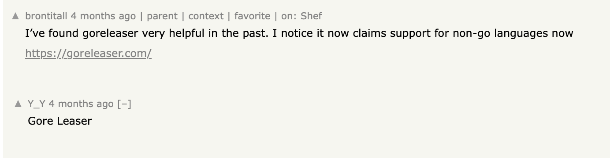
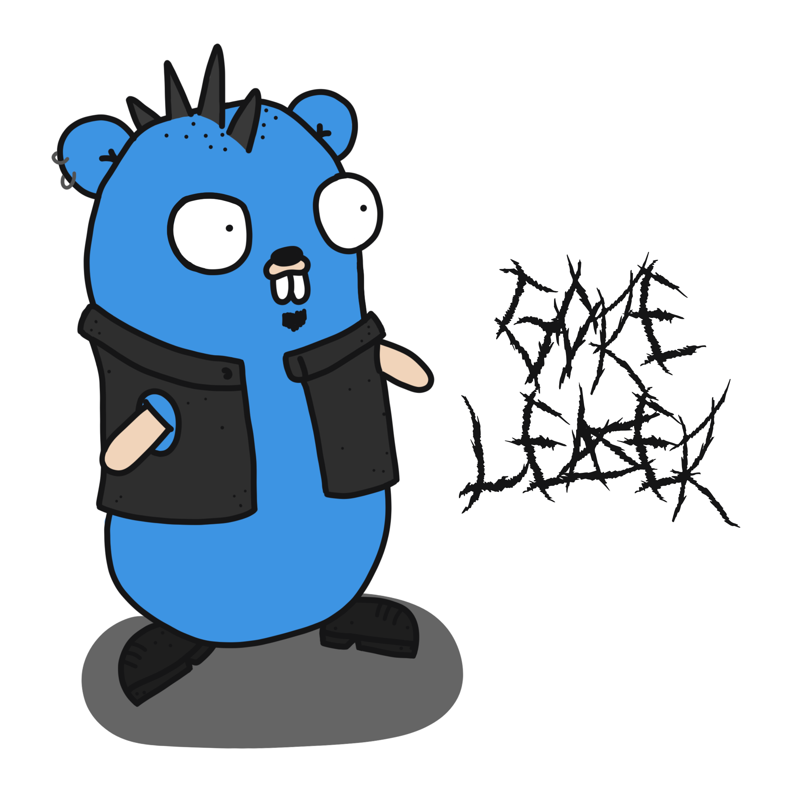

slidenumbers: true
footer: Carlos Becker - Codecon Summit 2025
slide-transition: fade(0.5)
theme: Plain Jane

# [fit] Building GoReleaser

## [fit] from shell script to paid product

---

# $ whoami

Carlos Alexandro Becker

- `@caarlos0` most places
- works `@charmbracelet`
- maintains `@goreleaser`
- [`caarlos0.dev`](https://caarlos0.dev)

---

# Agenda

1. What is GoReleaser
1. The Lore
1. Lessons learned
1. The Future

---

# GoReleaser

- Release automation tool
- Build, package, sign, publish, announce
- Configurable through a `.yaml` file
- Nudges you into doing the _"right thing"_
- Supports Go, Rust, Zig, Python, and TypeScript
- [goreleaser.com](https://goreleaser.com)

---

# The Lore

---

## 2015: Epoch

- I was working on one of my Go projects
- Created a [`release.sh`](https://github.com/getantibody/antibody/commit/5d06dae0c78d1655fc243183f96d8a0a7a3cc197)
- Didn't think anything of it
- Same as thousands before

---

## 2016: Rewrite in Go

- I now have a dozen of Go projects
- Moved that script into its [own repository](https://github.com/getantibody/antibody/commit/5d06dae0c78d1655fc243183f96d8a0a7a3cc197)
- Doing OSS during EOY holidays, needed more features
- Rewrote it in Go
- Shared it online, and people liked it!

---

## 2017: Spreading the word

- Kept adding features to it
- Wife drew the mascot/logo
- Using it in all my Go projects
- Talking about it in local Meetups
- \>1k stars

---

## 2018: Burning out

- Created nFPM & OpenCollective
- \>1k public repositories using it
- More meetups & _Gophercon Brazil_
- Refactored core to support multiple languages, eventually
- \>3k stars
- Burnout

---

## 2019 & 2020: Recovering and COVID

- Recovering from burnout
- Planning v1.0.0
- \>5k stars

---

^ quer dizer, 2020 é basicamente um borrão, nem lembro da maior parte
mas FWIW, terminei 2020 muito melhor de saude fisicamente e mentalmente.

---

## 2021: We are SO back!

- _GoTime_ Podcast
- Launched **v1.0.0!** 🎉
- GitHub Sponsors
- Proper release announcements
- **GoReleaser Pro**
- \>9k stars

---

## 2022: Full-time open source

- Working at Charm, doing OSS all day long
- Split & Merge, `--nightly`, AUR
- \>10k stars

---

## 2023: More professional

- Proper [release cadence](https://goreleaser.com/blog/release-cadence/#thank-you-notes)
- Ko, health check, upx, nix, Winget
- \>12k stars

---

## 2024: At last, multiple languages

- Launched **v2.0.0** 🎉
- Rust and Zig support!
- DMG, MSI, macOS notary, App Bundles, and more
- \>14k stars
- \>100 pro customers

---

## 2025: Moving forward

- Bun, Deno, Poetry, and UV support
- AI changelog, MCP server, NPM, Casks
- _Cup o' Go_ and _Fallthrough_ Podcasts
- Better support for desktop apps
- \~200 customers, \~15k stars
- _Codecon Summit_ 🙃

---

# Lessons learned

---

## Boring software

- People want _predictability_ instead of _novelty_ when releasing their software
- Boring is _predictable_
- _Boring is good_, actually

---

## Distribution

- Really hard, unless you are a _tech influencer_
- Creator and creation get conflated
- If you are a _tech influencer_, then you might have other problems

---

## Naming things

- "it releases Go binaries, its a Go Releaser"

---

## Naming things

- "it releases Go binaries, its a Go Releaser"
- "gore leaser"
- mix up with `gorelease` (without the `r`)
- the **Go** prefix

---

## Pricing

- Harder than pricing physical products
- _Guess_ based on what you know and what you think it's worth
- Enterprises usually expect overcharging (legal, forms, etc)

---

## Licensing

- MIT is probably too permissive
- Changing later might feel like bait-and-switch
- Consider changing it earlier rather than later

---

## Flexibility, Simplicity, and finding balance

- I love flexible software
- It leads to madness
- I hate flexible software
- Scope creep, accidental complexity

---

## Building products

- Side projects: for fun and studying
- Products: solving problems

---

# The Future

---

## The future

- Support more languages and distribution channels
- Improve docs, error messages, small feats, etc
- tl;dr keep working on it

---

# PS: I have stickers!

## Come chat and I'll give you some 😉

---

---

# Links

- [caarlos0.dev](https://caarlos0.dev)
- [goreleaser.com](https://goreleaser.com)
- [carlosbecker.com/posts/codecon-goreleaser](https://carlosbecker.com/posts/codecon-goreleaser)
- [github.com/caarlos0/codecon-2025](https://github.com/caarlos0/codecon-2025)
