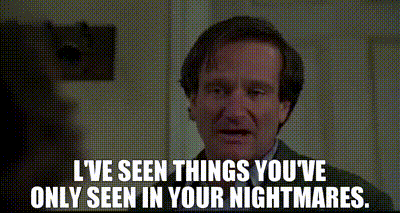

slidenumbers: true
footer: Carlos Becker - Codecon Summit 2025
slide-transition: fade(0.5)
theme: Plain Jane

# [fit] Building GoReleaser

## [fit] from shell script to paid product

^ hi! i'm very happy to be here today, and I hope this is interesting to y'all

---

# $ whoami

Carlos Alexandro Becker

- `@caarlos0` most places
- works `@charmbracelet`
- maintains `@goreleaser`
- [`caarlos0.dev`](https://caarlos0.dev)

^ i'm no influencer, so this is me and my dog, bash.
work, oss stuff, site with socials

---

# Agenda

1. What is GoReleaser
1. The Lore
1. Lessons learned
1. The Future

^ what i planned for today is to quickly explain what goreleaser is, tell you
how it got where it is today, share some things I learned, some of which are
maybe a bit counter intuitive, and the plans for the future.
its not the washed down story, but the real stuff that happened, both good and ugly

---

# GoReleaser

- Release automation tool
- Build, package, sign, publish, announce
- Configurable through a `.yaml` file
- Nudges you into doing the _right thing_
- Supports Go, Rust, Zig, Python, and TypeScript
- [goreleaser.com](https://goreleaser.com)

---

# The Lore

---

## 2015: The beginning

- I was working on one of my Go projects
- Created a [`release.sh`](https://github.com/getantibody/antibody/commit/5d06dae0c78d1655fc243183f96d8a0a7a3cc197)
- Didn't think anything of it
- Same as thousands before

^ it starts kind of by accident.
I was just learning go, and had a side project.
I created a shell script, without knowing it'll end up being a product.
It was nothing special, just a shell script, like many before it, and many after it
honest work, though

---

## 2016: Rewrite in Go

- I now have a dozen of Go projects
- Moved that script into its [own repository](https://github.com/getantibody/antibody/commit/5d06dae0c78d1655fc243183f96d8a0a7a3cc197)
- Doing OSS during EOY holidays, needed more features
- Rewrote it in Go
- Shared it online, and people liked it!

^ Now with more project, all of them need releasing - Configuration via `--flags`
It sucked, but scratched the itch
"I need Homebrew" "It'll suck to do that with bash..." "Gonna make this into a Go project!"
shared it online, and to my surprise people liked it!

---

## 2017: Spreading the word

- Kept adding features to it
- Wife drew the mascot/logo
- Using it in all my Go projects
- Talking about it in local Meetups
- \>1k stars

^ as it rose in popularity, I kept adding more features, wife drew a mascot, and I started talking about it in some local meetups
by EOY it had about 1k stars already

---

## 2018: Burning out

- nFPM
- \>1k public repositories using it
- OpenCollective
- More meetups + _Gophercon Brazil_
- Refactored core to support multiple languages, eventually
- Burnout

^ created nfpm, the first spinoff project.
OpenCollective had some cool companies donating, and is still active today.
1k repos based on github search.
wanted to support multiple langs as plugins.
burnout: if you constantly ask yourself whether you are burn out or not, it might be worth checking it. Also, if your partner says you work too much, they probably right
i still don't really feel too comfortable talking about this, but I did write a bit about more it, link gonna be in the end of the slides.

---

## 2019 & 2020: Recovering and COVID

- Recovering from burnout
- Planning v1.0.0
- \>5k stars

^ exercise, cut alcohol, eat clean, lower social media usage
also started talking about a v1, but i was mostly just cruising along and trying to work on other stuff

---

^ i mean 2020 is basically a blur i don't even remember most of it

---

## 2021: We are SO back!

- _GoTime_ Podcast
- Launched **v1.0.0!** 🎉
- GitHub Sponsors
- **GoReleaser Pro**

^ 2021 was a good year!
being at a podcast of that caliber was something that young me would never dream of. it felt like a big achievement, especially considering i come from a simple family from rural brazil.
was on the first batch to have sponsors enabled in brazil, or maybe SA, don't remember.
sponsors did give some money, but it didn't feel sustainable, and it is usually more "fame" related than anything else
so, to try to make things sustainable, I launched goreleaser pro, a paid version with extra features.
i confess, I thought it wouldnt work, and if it didnt, i was probably gonna move on to something else
to my surprise, it did! and now the real fun begins

---

## 2022: Full-time open source

- Working at Charm, doing OSS all day long
- Split & Merge, `--nightly`, AUR
- Proper release announcements
- \>10k stars

^ started working at charm, doing mostly dev tooling oss there.
it was my dream years earlier, fulfilled it by accident, feelings of not deserving it.
anyway, continue to work on things, like split and merge, nightly builds, and more.
also, got to 10k stars

---

## 2023: More professional

- Proper [release cadence](https://goreleaser.com/blog/release-cadence/#thank-you-notes)
- Ko, health check, upx, nix, Winget
- \>12k stars

^ by 2022 i was already following more or less 1 feature release per month, but in 2023 I made it official.
also documented properly which versions are supported, etc etc.
also added many new features, like Ko, upx, nix, winget, and more
and we hit 12k stars

---

## 2024: At last, multiple languages

- Launched **v2.0.0** 🎉
- Rust and Zig support!
- DMG, MSI, macOS notary, App Bundles,
- \>14k stars
- \>100 pro customers

^ finally, launched v2, and then, thanks to friends pushing me, finally added Rust support.
Rio terminal is the first "real application" using goreleaser + rust.
Also added more stuff around releasing desktop applications vs binaries, e.g. dmg, msi, notarization, app bundles, etc.
It took years to get 100 customers - but at this point, it finally feels like a business.
Free version does too much, probably.

---

## 2025: Moving forward

- Bun, Deno, Poetry, and UV support
- AI changelog, MCP server, NPM, Casks
- _Cup o' Go_ and _Fallthrough_ Podcasts
- Better support for desktop apps
- \~200 customers, \~15k stars, \~7k commits
- _Codecon Summit_ 🙃

^ which brings us to 2025, the year of the linux on the desktop. we're gaming on arch linux handhelds, what a time to be alive.
well, added support to python and typescript.
I put it as a goal of mine this year to speak in two conferences, this is the second one! I also went into 2 podcasts so far
Pro now has 200 paying customers, and a very good MRR. Speaking in brazilian moneys, it pays more then my last job as a senior SRE in Brazil.
Super happy about that!

---

# Lessons learned

^ well, now onto some of the mistakes I made over the years, and what I learned.

---

## Boring software

- People want _predictability_ instead of _novelty_ when releasing their software
- Boring is _predictable_
- _Boring is good_, actually

^ people don't want surprises in some parts of their lifes, they want stability.
software releases is already full of anxiety as is, the software that does it should be predictable.
boring software is predictable, that's one of the reasons its boring.
everyone wants to work on whatever is cool now, but boring software runs most of the infrastructure, and it'll likely stay that way for a very long time.
maybe its just me getting old, but I now kinda like boring software.
boring software is good, actually, most of the times.

---

## Distribution

- Really hard, unless you are a _tech influencer_
- Creator and creation get conflated
- If you are an influencer, you have other problems

^ this is the hardest problem to solve, and there's no magic solution to it, as it has a lot to do with "vibes" and luck.
if you get someone famous to use and talk about your thing, you gonna fly high, but that's easier said than done.
also I'm the goreleaser guy, and that's fine, its just something that might happen.
So what you say personally also affects the view of your product, and vice-versa.
If you are influencer i figure you might have other problems, you gotta ask yourself if your thing is doing numbers because its actually good, or if it is because it is you who made it. Likely a combination of both.

---

## Naming things

- "it releases Go binaries, its a Go Releaser"

^ i came up with the name after thinking about it for like 5 seconds.
i didn't realize you could read it wrong after too long.

---

## Naming things

- "it releases Go binaries, its a Go Releaser"
- "gore leaser"
- mix up with `gorelease` (without the `r`)
- the **Go** prefix

^ eventually, it became sort of a running joke - with art and all
gorelease without the r from the Go release team.
go prefix kinda locked me in for a long time, and I bet i'm loosing new users because of it
and then sometimes perfectly fine english words sound like slur in other languages, etc, etc etc
if you're doing something you think might be something big, think hard about the name.
naming things is hard

---

## Pricing

- Harder than pricing physical products
- _Guess_ based on what you know and what you think it's worth
- Enterprises usually expect overcharging
- Legalese, forms, etc

^ physical products you can derive the price from the materials plus labor.
software you're basically allowing access to it, not selling something.
in my case, there arent even any servers, its just paying for the right to use extra features.
its hard to price, especially from a POV you don't know.
I worked mostly in small to medium companies, but really big ones are completely different game.
lots of legalese, docs, etc
they expect to be overcharged for that
so overcharge do overcharge.

---

## Licensing

- MIT is probably too permissive
- Changing later might feel like bait-and-switch
- Consider changing it earlier rather than later

^ for better or worse, i always use MIT, its very permissive... almost too permissive
we all seen it: big corps selling oss as a service, that kind of thing.
problem is us, the community.
if any big-ish oss project changes the license, we all complain.
and we also complain if big corps do big corp stuff, which could be prevented by the first thing.
anyway, always have a thread with that running in your head, the best time to change the license was yesterday, second best time is today - assuming you're not big yet.
once you have too many stars, people will feel like its bait and switch.
you also can't relicense contributions without their approval, and that might simply not be possible (e.g. people die)
anyway, consider your license as early as possible, if i was gonna start something that I think might be very good, I'd start with a different license, probably

---

## Flexibility, Simplicity, and finding balance

- I love flexible software
- It leads to madness
- I hate flexible software
- Scope creep, accidental complexity

^ we love flexible software. spreadsheets is a good example.
the more flexible, the crazier it gets, and as a maintainer, you'll get insane tickets that you'll have to understand if you want to help your user.
so, think hard about it. each new knob you add in combination with all the other knobs already there. i've seen things...
my learnings on simplicity are a bit more straightforward maybe: its easy talk on new, small software, almost impossible to avoid in old, big software, in the long run.
you keep adding things, you have users now, so you can't always do it the best way because it might be a breaking change, or take too long, so things get complicated.
you will end up with some accidental complexity as the scope creeps in.
the real hard task there is to find balance between scope, simplicity, flexibility, and avoiding breaking changes.
listen to your gut, its right most of the time. reflect on things, don't be too reactive.

---

## Building products

- Starting from an existing problem will give you better chances of succeeding
- Side projects for fun and studying are still good though!

^ this is maybe the most obvious one but I think its still worth talking about:
I try to start from a problem, not from something I want to implement.
Note that I'm talking solving problems, not puzzles.
We should still play with things for the sake of playing with them, its fine.
I'm talking specifically about making products.
By definition its not just a side project, then, its something else, something you maybe want to sell.
If so, its the same advice given years ago when everyone was doing startups that were not AI: start from a problem you have.
we all have some, and we can fix one of them, probably, so do fix it, that's your product.

---

# The Future

---

## The future

- Support more languages and distribution channels
- Improve docs, error messages, etc
- tl;dr keep working on it

^ my plans for the future are boring :)
anyway, I'll probably add more languages and distribution channels, and keep working on everything else
i hope this talk has been of some value to you, and thanks for your time.

---

# PS: I have stickers!

## Come chat and I'll give you some 😉

---

^ well, thats what i have for today, thanks for your attention. hope you enjoyed
it.

---

# Links

- [caarlos0.dev](https://caarlos0.dev)
- [goreleaser.com](https://goreleaser.com)
- [carlosbecker.com/posts/codecon-goreleaser](https://carlosbecker.com/posts/codecon-goreleaser)
- [github.com/caarlos0/codecon-2025](https://github.com/caarlos0/codecon-2025)
